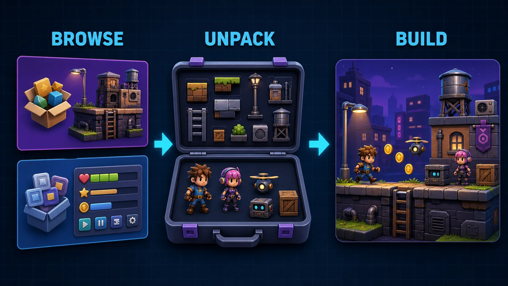

# DCC-MCP Kenney Assets



Search, inspect, and download free Kenney asset packs.

## Install

```bash
dcc-mcp-cli marketplace add dcc-mcp/dcc-asset-kenney
dcc-mcp-cli marketplace install dcc-asset-kenney
```

## License And Usage

Kenney's support page says assets on the asset pages are public domain licensed
under CC0 and can be used in commercial projects. Attribution is not required,
but the Kenney logo is reserved for official Kenney projects.

This skill returns `license_name` and `license_url` for every inspected or
downloaded asset.

Downloads also return a validated `asset_descriptor` with the downloaded zip,
Kenney source URL, and CC0 attribution. The zip may need extraction by a DCC
adapter before scene import.

## Tools

- `search_kenney_assets`
- `inspect_kenney_asset`
- `download_kenney_asset`
