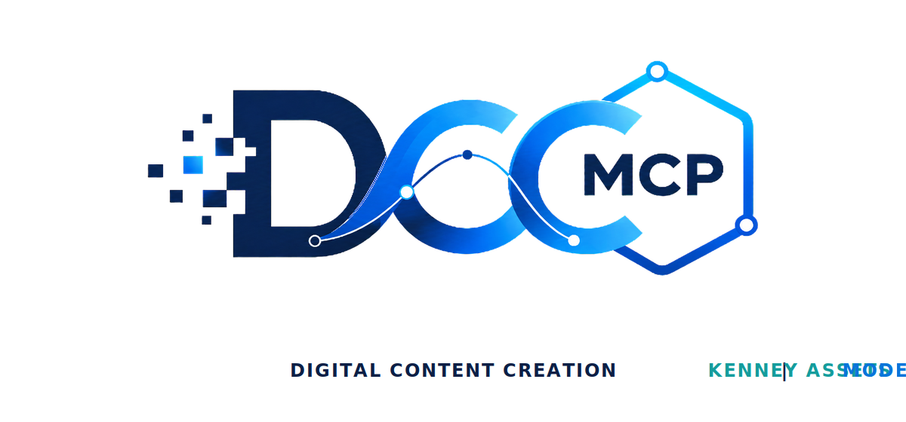

# DCC-MCP Kenney Assets

<p align="center">
  
</p>

## Agent workflow

AI agents should use installed package skills through the shared gateway. IDE
users may continue to use the MCP endpoint.

### Install or update the CLI

`dcc-mcp-cli` is the preferred control path for every shell-capable agent. If
it is missing, ask the user before installing the latest official release:

```bash
# Linux/macOS
curl -fsSL https://raw.githubusercontent.com/dcc-mcp/dcc-mcp-core/main/scripts/install-cli.sh | sh

# Windows PowerShell
powershell -ExecutionPolicy Bypass -c "irm https://raw.githubusercontent.com/dcc-mcp/dcc-mcp-core/main/scripts/install-cli.ps1 | iex"
```

Keep an official build current through the release manifest:

```bash
dcc-mcp-cli update check
dcc-mcp-cli update apply
```

`update apply` downloads and stages the latest CLI for the next launch. It
does not update a running `dcc-mcp-server`; update that server in its own
environment.

```bash
dcc-mcp-cli dcc-types
dcc-mcp-cli list
dcc-mcp-cli search --query "<task>" --dcc-type <host>
dcc-mcp-cli describe <tool-slug>
dcc-mcp-cli call <tool-slug> --json '{"key":"value"}'
```

If the package skill is not active, call
`dcc-mcp-cli load-skill <skill-name> --dcc-type <host>`. After the task,
query `dcc-mcp-cli stats --range 24h --session-id <task-id>` and pass only
bounded evidence to the `review_skill_improvement` prompt from
`dcc-mcp-skills-creator`.


Search, inspect, and download free Kenney asset packs.

## Install

```bash
dcc-mcp-cli marketplace add dcc-mcp/dcc-asset-kenney
dcc-mcp-cli marketplace install dcc-asset-kenney
```

## License And Usage

Kenney's support page says assets on the asset pages are public domain licensed
under CC0 and can be used in commercial projects. Attribution is not required,
but the Kenney logo is reserved for official Kenney projects.

This skill returns `license_name` and `license_url` for every inspected or
downloaded asset.

Downloads also return a validated `asset_descriptor` with the downloaded zip,
Kenney source URL, and CC0 attribution. The zip may need extraction by a DCC
adapter before scene import.

## Tools

- `search_kenney_assets`
- `inspect_kenney_asset`
- `download_kenney_asset`
